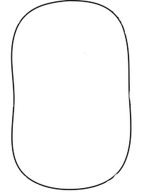

# Make A GIF



Make a beautiful GIF from JPEG files !

## Install

Clone the repository.

```
git clone https://github.com/chbes/makeagif
```

Build the source to get an executable.

*You can choice the name of your executable, replace **mag** by **yourname***

```
go build -o mag cmd/main.go
```

## Utilization

Command below create a new GIF **Gopher**, from all images found in the folder **inputs**.

*You can create a GIF from JPEG or PNG images.*

```
./mag -inFolder="inputs" -outFile="Gopher"
```

```
.
+-- Gopher.gif
+-- intputs
|   +-- IMG_001.jpeg
|   +-- IMG_002.jpeg
|   +-- IMG_003.jpeg
```

The flag **-factory** in the command below launch the factory mode. It create one new GIF from each folder found in the current folder then put them in the folder **ouputs**.

```
./mag -outFolder="ouputs" -factory
```

Before:
```
.
+-- Moon
|   +-- picture1.jpg
|   +-- picture2.jpg
+-- Sun
|   +-- IMG_001.jpeg
|   +-- IMG_002.jpeg
|   +-- IMG_003.jpeg
+-- Wouah
|   +-- IMG_100.png
|   +-- IMG_101.png
```

After:
```
.
+-- outputs
|   +-- Moon.gif
|   +-- Sun.gif
|   +-- Wouah.gif
+-- Moon
|   +-- picture1.jpg
|   +-- picture2.jpg
+-- Sun
|   +-- IMG_001.jpeg
|   +-- IMG_002.jpeg
|   +-- IMG_003.jpeg
+-- Wouah
|   +-- IMG_100.png
|   +-- IMG_101.png
```

## User Manual

```
  -d int
        delay into each image, in millisecond (default 50)
  -factory
        factory mode
  -h uint
        GIF height (0 = ratio preserving)
  -inFolder string
        folder contains input images (default ".")
  -info
        get informations
  -outFile string
        new GIF name (default input folder name)
  -outFolder string
        folder contains output GIF (default input folder)
  -v
        verbose mode
  -vv
        very verbose mode
  -w uint
        GIF width (0 = ratio preserving)
```

## Dependecies

* [nfnt/resize](https://github.com/nfnt/resize/) - Pure golang image resizing

## License

This project is licensed under the GPL-3.0 License - see the [LICENSE.md](LICENSE.md) file for more details.
